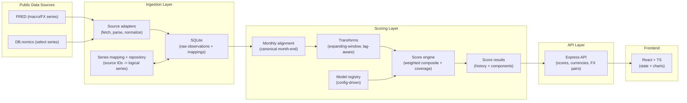

# Architecture (Public Showcase)

This document describes the architecture at a high level without exposing private implementation details.

## System Overview

MarketGauge is a three‑stage pipeline:

1. **Ingest** raw macro/FX time series (multi‑source) into SQLite.
2. **Score** monthly models (0–100) with backtest‑safe transforms and confidence metadata.
3. **Serve + Visualize** results via a JSON API and a React dashboard.

## High-Level Diagram

## Core Concepts

- **Canonical score date:** end of calendar month (month‑end). Everything aligns to that date.
- **Model registry:** models are described via config entries (components, weights, transforms).
- **Series repository:** scoring asks for “logical series” (e.g., “US unemployment”), not provider IDs.
- **Backtest safety:** transforms are expanding‑window so historical values use only prior information.
- **Coverage & confidence:** missing indicators rescale remaining weights and emit confidence labels.

## Data Model (public-level)

SQLite stores:

- Entities (macro regions), currencies, and FX pairs
- Logical series mappings (logical name -> provider + provider ID)
- Raw observations (provider payload normalized into a consistent table)
- Score results (model score by month-end) + component-level breakdowns
- Optional validation outputs (metrics and backtest artifacts)

## Extensibility: Adding a New Model (example workflow)

At a high level, adding a new model should look like:

1. Add/verify series mappings for required indicators.
2. Register a new model config entry (components, weights, transforms).
3. Add a model module implementing the model’s component definitions.
4. Backfill and validate historical output.
5. Expose via API + add a dashboard view.

This keeps the scoring engine generic and pushes model-specific logic into model modules/config.

