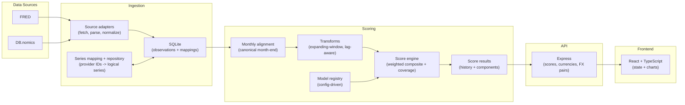

# Architecture

MarketGauge is a three-stage pipeline:

1. Ingest raw macro/FX time series (multi-source) into SQLite.
2. Score monthly models (0–100) using backtest-safe transforms and confidence metadata.
3. Serve results via a JSON API and render them in a React dashboard.

## High-Level Diagram

## Core Concepts

- Canonical score date: end of calendar month (month-end). Everything aligns to that date.
- Model registry: models are described via config entries (components, weights, transforms).
- Series repository: scoring requests logical series (e.g., “US unemployment”), not provider IDs.
- Backtest safety: transforms are expanding-window so historical values use only information available at the time.
- Coverage & confidence: missing indicators rescale remaining weights and emit confidence labels.

## Extensibility: Adding a New Model

High level workflow:

1. Add/verify series mappings for required indicators.
2. Register a new model config entry (components, weights, transforms).
3. Implement the model module’s component definitions.
4. Backfill and validate historical output.
5. Expose via API and add a dashboard view.

